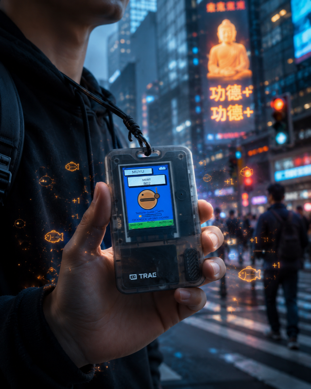

# Woodfish Merit Counter · FoloToy AI Passport

English | [简体中文](README.zh_CN.md)

<p align="center">
  
</p>

A knock-the-woodfish merit counter (敲木鱼积功德) for the [FoloToy AI Passport](https://github.com/folotoy/ai-passport) wearable — built by **Nick** with TRAE. The device boots straight into the app: press `OK` and the merit goes up.

## Features

- Merit counter with ranks (100 → 100 000) and combo detection, persisted in NVS across power loss
- Four synthesized knock tones: CLASSIC woodfish · BELL · BLOCK · water DROP
- Battery gauge (CW2017) with 30 s refresh and low-battery warning color
- 2-minute auto screen-off; auto-knocking keeps counting and sounding in the dark
- Mute, auto-knock, tone, and backlight level all persisted

| Key | Action | Function |
| --- | --- | --- |
| `OK` | press | Knock: merit +1, sound, animation, floating "+1" |
| `OK` | long | Save & exit, back to the menu (in menu: enter selection) |
| `UP` | short | Mute / unmute (in menu: move selection up) |
| `DOWN` | short | Cycle tone CLASSIC / BELL / BLOCK / DROP (in menu: move selection down) |
| `DOWN` | long | Auto-knock every 0.7 s |
| `PWR` | — | Hardware switch: cuts power directly, invisible to firmware |

> **The power key on this device is a hardware switch** — it cuts power
> directly and is invisible to the firmware; power on/off is done by it, the
> woodfish screen sleeps after 2 min idle and any key wakes it. The firmware
> keeps a software interface for an independent power key (`BSP_PWR_BTN_GPIO`
> in `bsp_pins.h`): set a pin and short-press toggles the screen, long-press
> (1.5 s) powers off from any page (deep sleep, `UP` wakes). Note every GPIO
> on this board is already in use and GPIO11–17 are the onboard flash pins
> (touching them crashes the chip), so keep `-1`. On a custom board with the
> power key on the button resistor ladder, open the Button page, hold the key
> and watch the ADC voltage, then extend `BSP_BTN_MV_TABLE` to 4 bands.

## Web flashing

Open the web flasher and connect the device via USB:

**https://ai-passport.folotoy.cn/tools/web-flasher/**

Select the merged single-file image (`woodfish-flash-all.bin`, written at offset `0x0`), optionally enable "erase device data", and start. Build your own merged image:

```bash
idf.py build
python -m esptool --chip esp32c3 merge_bin -o woodfish-flash-all.bin \
  --flash_mode dio --flash_size 8MB --flash_freq 80m \
  0x0 build/bootloader/bootloader.bin \
  0x8000 build/partition_table/partition-table.bin \
  0x10000 build/FoloToy-AI-Passport.bin
```

## Build from source

ESP-IDF 5.5.x (known-good: 5.5.3):

```bash
idf.py set-target esp32c3     # fresh checkout only
idf.py build
idf.py flash monitor
```

Host-side logic test (no hardware needed):

```bash
cc -std=c11 -Wall -Wextra -Werror -Imain \
  tests/test_woodfish_model.c main/woodfish_model.c \
  -o /tmp/test_woodfish_model
/tmp/test_woodfish_model
```

## Author

**Nick** ([nistudyc](https://github.com/nistudyc)) — built on the [folotoy/ai-passport](https://github.com/folotoy/ai-passport) development baseline with TRAE.

---

# For developers — FoloToy AI Passport baseline

This repository is also the development baseline of the FoloToy AI Passport (open wearable AI hardware for AI agents). `main` is the smallest complete runnable baseline; `components/bsp` isolates board-level details behind stable APIs; `demo/*` branches show different paths from requirement to working implementation. Read `AGENTS.md` before working in the repo, and keep build results and physical-device results separate — a successful build is never successful hardware validation.

## Hardware capability contract

| Capability | Confirmed implementation | Application interface | Boundaries that must be respected |
| --- | --- | --- | --- |
| Display | ST7789P3, 240 × 320 portrait RGB565, SPI2 at 40 MHz; LEDC backlight | `bsp_display_*`, `bsp_lvgl_*` | The ESP32-C3 has no PSRAM; small single DMA buffer; no LCD MISO, touch, or known TE interface |
| Input | `UP`, `DOWN`, `OK` share an ADC resistor ladder on GPIO0 | `bsp_button_init()`, `bsp_button_read_mv()` | Callbacks run in the button component task and must not block; do not create a second ADC1 unit |
| Audio | ES8311 full-duplex PCM over I2S0 | `bsp_audio_*` | PCM reads and writes block and belong in a worker task; format changes must retain the BSP close/open sequence |
| Battery | CW2017 state-of-charge and voltage | `bsp_battery_*` | Optional at runtime; accuracy depends on the cell and profile |
| Shared bus | ES8311 and CW2017 share I2C0 | `bsp_i2c_*` | Reuse the BSP-owned bus; do not create another bus on the same port |
| Logging / flashing | Native ESP32-C3 USB Serial/JTAG | ESP-IDF console | GPIO18/19 reserved for USB; UART0 TX on GPIO21 conflicts with the backlight |

All pins, addresses, panel parameters, and button voltage windows are defined only in [`components/bsp/include/bsp_pins.h`](components/bsp/include/bsp_pins.h). When board revision, wiring, polarity, or register behavior is unknown, report the unknown and request evidence instead of filling the gap with parameters from another ESP32-C3 board. See [`docs/AI_HARDWARE_DEVELOPMENT_GUIDE.md`](docs/AI_HARDWARE_DEVELOPMENT_GUIDE.md) for the complete pin map, panel initialization, ADC thresholds, I2C rules, and memory details.

Capabilities not yet guaranteed: touch, display readback, IMU, external storage, charging control, USB insertion detection, deep-sleep wakeup wiring, arbitrary "free GPIOs", and production power specs. Requirements touching these must begin with a schematic, board revision, or physical measurement.

## Application and BSP boundary

```text
main/                     Pages, state machines, animation, app tasks, assets
  └─ components/bsp/include/  Stable board-level APIs
      └─ components/bsp/src/  GPIO, buses, devices, and driver details
          └─ bsp_pins.h       Single source of truth for pins and hardware parameters
```

To add a page, create `main/demo_<feature>.c` implementing `enter`, `exit`, and `key`, then update `main/demo.h`, `main/CMakeLists.txt`, and the `DEMOS[]` registration in `main/main.c`. Only hardware capabilities shared by multiple applications belong in `components/bsp`.

### Runtime invariants

- LVGL is not thread-safe: hold `bsp_lvgl_lock()` outside the LVGL context.
- Button callbacks only dispatch lightweight events; slow work belongs in worker tasks.
- When leaving a page, stop every task or timer that may access its UI before deleting the screen.
- New images, fonts, network stacks, audio buffers, LVGL buffers, and task stacks must be evaluated against internal RAM (no PSRAM; free heap ≠ contiguous block).
- Testable state machines and timing logic should be separated from ESP-IDF/LVGL and covered by host-side tests.

## Acceptance and delivery format

`idf.py build` is the minimum automated check, not hardware validation. For changes involving physical peripherals, record on a real device: stable startup logs, correct display/backlight behavior, correct button events, audio playback, plausible battery readings, and no leaks across page transitions. Report:

```text
Build: PASS / FAIL / NOT RUN
Host tests: PASS / FAIL / NOT RUN
Device tests: PASS / FAIL / NOT RUN
Unverified: items that still require a board, instrument, or user confirmation
```

## Project structure

```text
components/bsp/include/  Public BSP APIs and bsp_pins.h hardware facts
components/bsp/src/      Display, button, audio, battery, and shared-I2C implementations
main/                    Menu, LVGL UI, hardware demo pages, and the woodfish app
tests/                   Lightweight logic tests that can run without hardware
docs/                    Agent hardware development guide and extension documentation
sdkconfig.defaults       ESP32-C3, USB console, Flash, and LVGL defaults
AGENTS.md                Coding, validation, and contribution rules for agents
```
